# **API RESTful - PreEntrega 3 - Grupo 2**

Este proyecto tiene como objetivo desarrollar una plataforma de streaming mediante el uso de Node.js y MySQL, siguiendo el modelo de datos presentado en el archivo trailerflix.json(tp1).


## Tabla de Contenidos
- [**API RESTful - PreEntrega 3 - Grupo 2**](#api-restful---preentrega-3---grupo-2)
  - [Tabla de Contenidos](#tabla-de-contenidos)
  - [Integrantes del grupo de trabajo](#integrantes-del-grupo-de-trabajo)
  - [Configuraciones iniciales](#configuraciones-iniciales)
  - [Modelo relacional](#modelo-relacional)
  - [Uso](#uso)
  - [Endpoints](#endpoints)
  - [Ejemplos de uso](#ejemplos-de-uso)
    - [📍 Obtener todos los títulos](#-obtener-todos-los-títulos)
    - [📍 Buscar un título por su nombre](#-buscar-un-título-por-su-nombre)
    - [📍 Buscar títulos por categoría (1: Series, 2: Películas)](#-buscar-títulos-por-categoría-1-series-2-películas)
    - [📍 Buscar los títulos con calificación mayor a 5](#-buscar-los-títulos-con-calificación-mayor-a-5)
    - [📍 Buscar todos los actores](#-buscar-todos-los-actores)
    - [📍Buscar un actor y todos sus títulos por su apellido](#buscar-un-actor-y-todos-sus-títulos-por-su-apellido)
    - [📍Buscar un actor y todos sus títulos por su nombre](#buscar-un-actor-y-todos-sus-títulos-por-su-nombre)
    - [📍Agregar un nuevo título](#agregar-un-nuevo-título)
    - [📍Modificar un título existente mediante su id](#modificar-un-título-existente-mediante-su-id)
    - [📍Eliminar el título con el id 16](#eliminar-el-título-con-el-id-16)
    - [📍Eliminar todos los títulos](#eliminar-todos-los-títulos)
  - [Manejo de Errores](#manejo-de-errores)

## Integrantes del grupo de trabajo
- [Viviana Beatriz Aguilera Valenzuela](https://www.linkedin.com/in/viviana-aguilerav)
- [Quimey Fernandez Yaryura](https://github.com/Quimeyaryuraa)
- [Paula Carolina Serrano](https://www.linkedin.com/in/paula-carolina-serrano/)


## Configuraciones iniciales
- Crear un archivo .env tomando como ejemplo a .env.example

- Instalación de dependencias:
```bash
npm install
```
## Modelo relacional
Diseño del modelo:
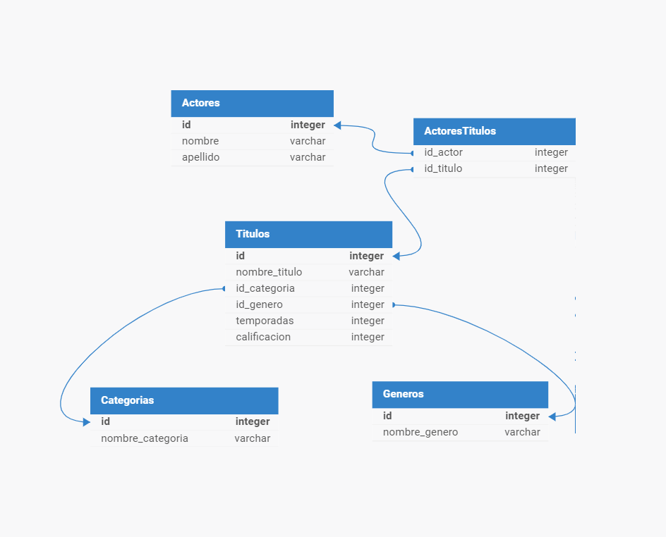

Estructura resultante:
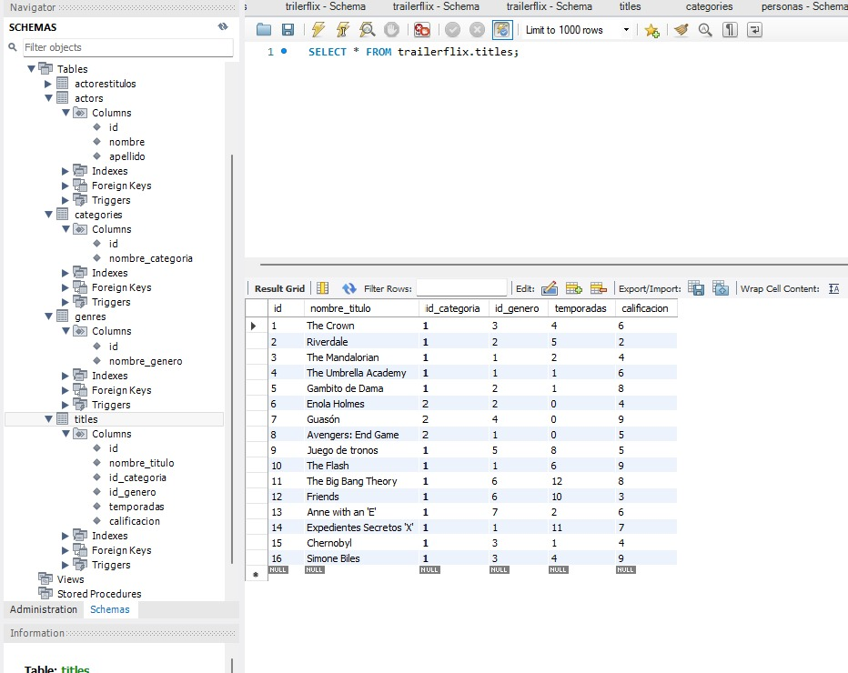

## Uso
1. Iniciar el servidor:
```bash
npm start
```
1. Acceder a la url del servidor de la forma que creas más conveniente. Recomendamos el uso de Thunder Client.
   
   http://localhost:3000

## Endpoints


| Método | URL                                      | Descripción                                                              | Parámetros                                      | Cuerpo de la Solicitud                  |
|--------|------------------------------------------|--------------------------------------------------------------------------|------------------------------------------------|-----------------------------------------|
| GET    | `/api/trailerflix/`                      | Muestra todos los títulos de las películas y series                      | N/A                                            | N/A                                     |
| GET    | `/api/trailerflix/:nombre`               | Filtra por películas o series específicas que incluyan el parámetro      | `nombre`: Título de película o serie            | N/A                                     |
| GET    | `/api/trailerflix/calificacion`          | Devuelve todos los títulos con una calificación mayor a 5                | N/A                                            | N/A                                     |
| GET    | `/api/trailerflix/categoria/:categoria`  | Filtra todos los títulos por categoría (serie/película)                  | `categoria`: 1: Serie o 2: Película            | N/A                                     |
| GET    | `/api/trailerflix/actor/todos`           | Muestra todos los actores                                                | N/A                                            | N/A                                     |
| GET    | `/api/trailerflix/actor/:nombre`         | Filtra por actor y muestra todos sus títulos                             | `nombre`: Nombre o apellido del actor                      | N/A                                     |
| POST   | `/api/trailerflix/`                      | Inserta un nuevo título                                                  | N/A                                            | Título en formato JSON*               |
| PUT    | `/api/trailerflix/:id`                   | Actualiza una película o serie con el ID indicado                        | `id`: ID de la película o serie                 | Datos del título en formato JSON*     |
| DELETE | `/api/trailerflix/:id`                   | Elimina una película o serie existente por su ID                         | `id`: ID de la película o serie                 | N/A                                     |
| DELETE | `/api/trailerflix/`                      | Elimina todas las películas o series existentes                         | N/A                                            | N/A                                     |


___*Ejemplos de código para el body:___ 
   ```json
   //POST: para agregar un nuevo título
{
    "nombre_titulo": "prueba3",
    "id_categoria": 1,
    "id_genero": 3,
    "temporadas": 4,
    "calificacion": 6
  }

  //PUT: para modificar, por ejemplo, la calificación del título.
  {
     "calificacion": 10
  }
```
## Ejemplos de uso
### 📍 Obtener todos los títulos
 GET -> http://localhost:3000/api/trailerflix

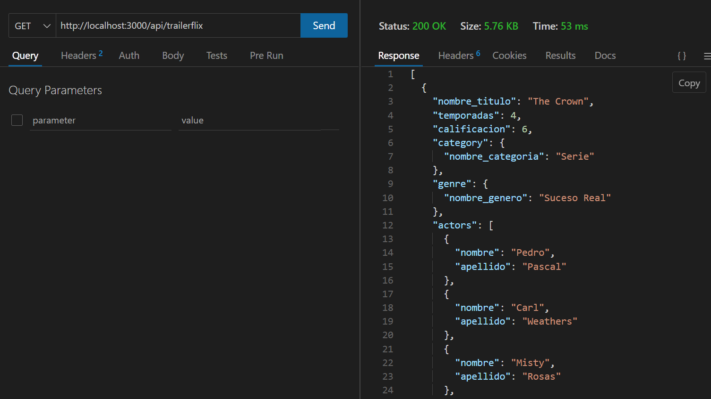
<br><br>

### 📍 Buscar un título por su nombre
 GET -> http://localhost:3000/api/trailerflix/gambito
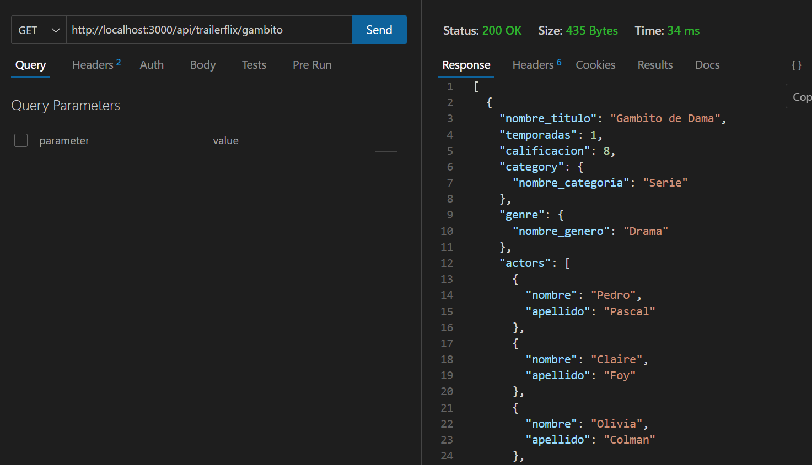
<br><br>

### 📍 Buscar títulos por categoría (1: Series, 2: Películas)
GET -> http://localhost:3000/api/trailerflix/categoria/1
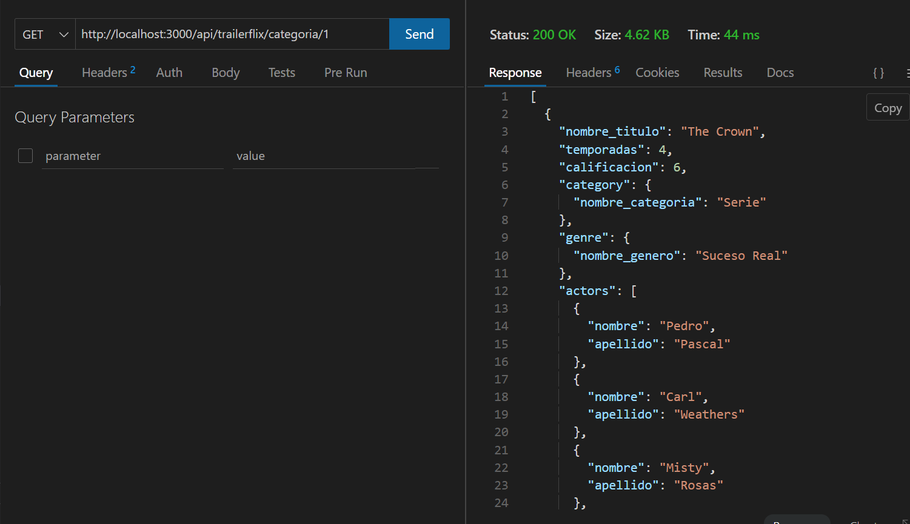
<br><br>

### 📍 Buscar los títulos con calificación mayor a 5
GET -> http://localhost:3000/api/trailerflix/calificacion
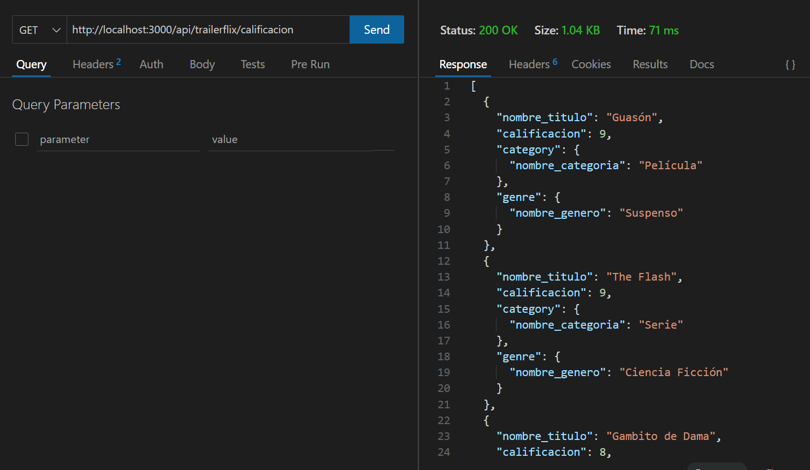
<br><br>

### 📍 Buscar todos los actores
GET -> http://localhost:3000/api/trailerflix/actor/todos
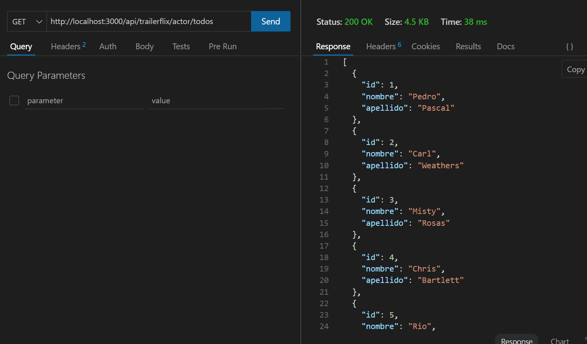
<br><br>

### 📍Buscar un actor y todos sus títulos por su apellido
GET -> http://localhost:3000/api/trailerflix/actor/Pascal
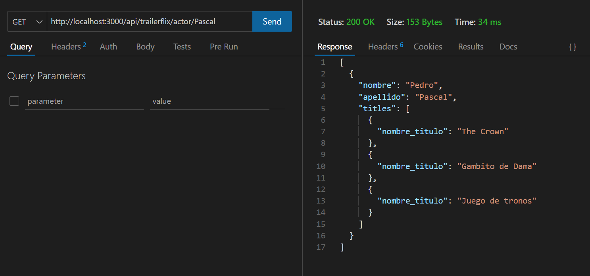
<br><br>

### 📍Buscar un actor y todos sus títulos por su nombre
GET -> http://localhost:3000/api/trailerflix/actor/Misty
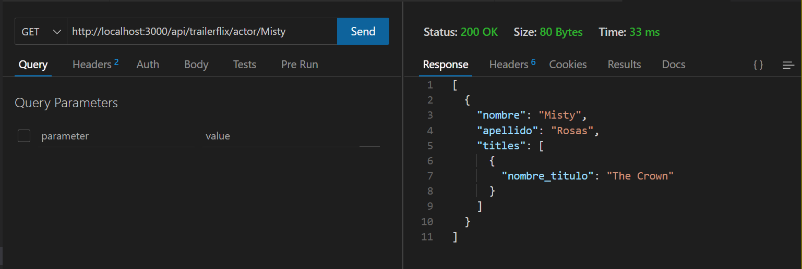
<br><br>

### 📍Agregar un nuevo título
POST -> http://localhost:3000/api/trailerflix

<br><br>

### 📍Modificar un título existente mediante su id
PUT -> http://localhost:3000/api/trailerflix/16
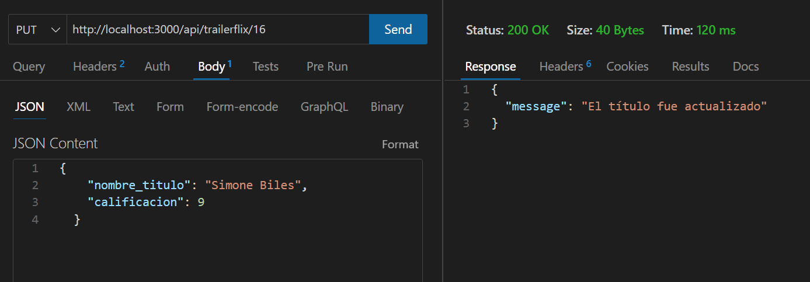
<br><br>

### 📍Eliminar el título con el id 16
DELETE -> http://localhost:3000/api/trailerflix/16

<br><br>

### 📍Eliminar todos los títulos
DELETE -> http://localhost:3000/api/trailerflix
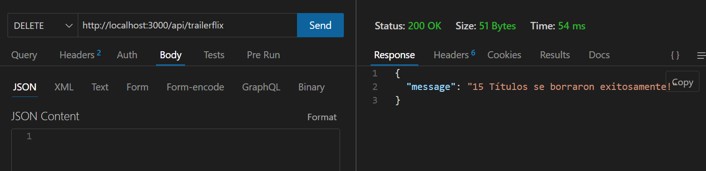
<br><br>

## Manejo de Errores
- 500: Error al conectarse a BBDD
- 400: Error en el formato de los datos (parámetros, body)


